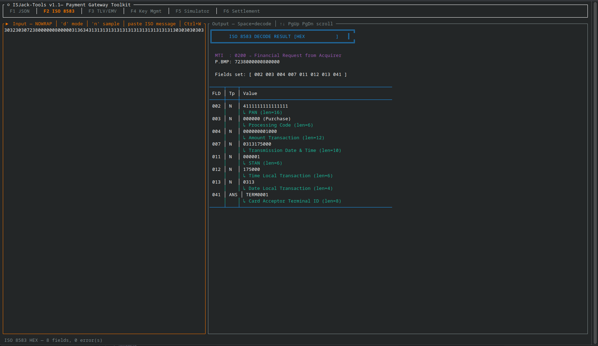
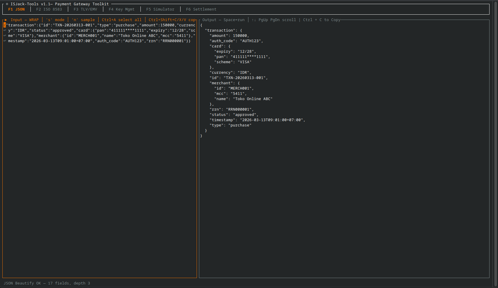
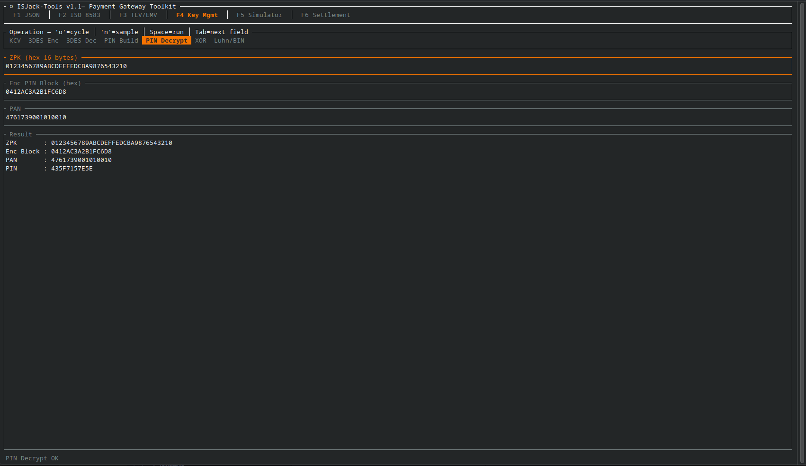
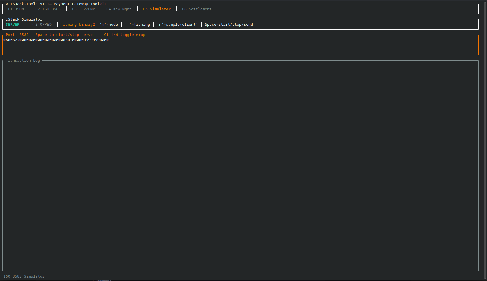
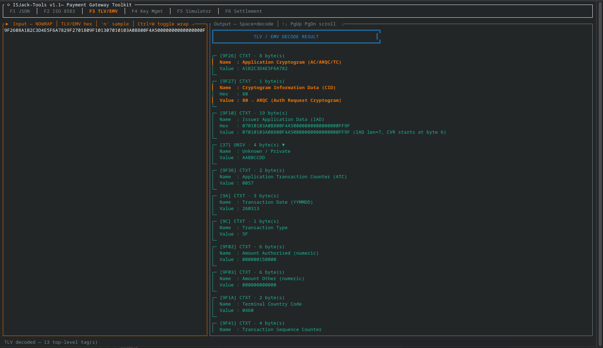
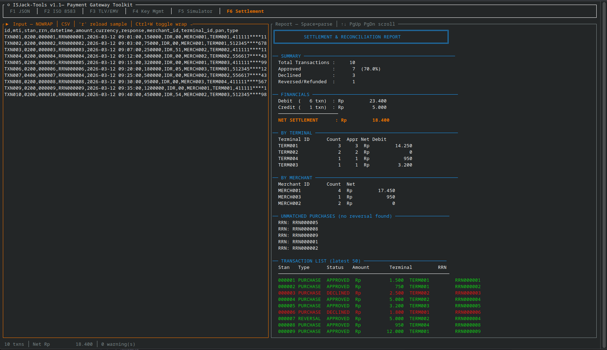

# IsJack Tool

IsJack Tool is a comprehensive Rust terminal UI application for payment systems development and testing. It provides tools for JSON processing, ISO 8583 message handling, cryptographic key management, TLV/EMV parsing, and network simulation.

## Features

- **JSON Tools**: Beautify and minify JSON data
- **ISO 8583 Decoder**: Parse and decode ISO 8583 financial messages (hex or raw format)
- **TLV/EMV Parser**: Decode EMV TLV structures including ARQC, AFL, and FCI
- **Key Management**: Cryptographic operations including:
  - KCV (Key Check Value) calculation
  - 3DES encryption/decryption
  - PIN block building and decryption
  - XOR operations for key XORing
  - Luhn/BIN validation
- **Simulator**: Network simulator for server/client testing with configurable framing
- **Settlement**: Batch settlement processing and reporting
- Multi-tab interface with keyboard-driven navigation and word-wrap support

## Prerequisites

- Rust 1.74 or later
- Cargo

## Build & Run

```bash
cd /home/asepimam/Documents/project/isjack_tool
cargo build --release
./target/release/isjack_tool
```

## Usage Guide

### JSON (F1)

Process JSON data with formatting and compression tools:
- Paste or type JSON into the input pane
- Press Space or use `s` to toggle beautify/minify mode
- Use `n` to load sample JSON data
- Output appears in the right pane with syntax highlighting

### ISO 8583 (F2)

Decode financial transaction messages in ISO 8583 format:
- Paste hex-encoded ISO 8583 messages into the input pane
- Press Space to decode and analyze
- Use `d` to toggle between hex and raw display modes
- Field names and values are parsed and displayed with clear formatting

### TLV/EMV (F3)

Parse EMV TLV-encoded EMV structures:
- Enter hex-encoded TLV data (ARQC, AFL, FCI, etc.)
- Press Space to decode tagged structures
- Supports nested TLV structures
- Use `n` to load EMV sample data (includes real ARQC and AFL examples)

### Key Management (F4)

Perform cryptographic operations:
1. Use `o` to cycle through operations:
   - **KCV**: Calculate key check value from key hex
   - **3DES Enc**: Encrypt data with 2-key or 3-key 3DES
   - **3DES Dec**: Decrypt 3DES-encrypted data
   - **PIN Build**: Build ISO PIN block from PIN and PAN
   - **PIN Decrypt**: Decrypt encrypted PIN block with ZPK
   - **XOR**: XOR two hex values (for key component derivation)
   - **Luhn/BIN**: Validate card number with Luhn algorithm
2. Fill in required fields (labels shown at top)
3. Press Space to execute operation
4. Results appear in the output pane

**Supported key sizes**:
- Single DES: 8 bytes
- 2-key 3DES: 16 bytes
- 3-key 3DES: 24 bytes

### Simulator (F5)

Network simulator for testing ISO 8583 message exchange:
- Use `m` to toggle between Server and Client modes
- **Server mode**: Start TCP listener on configured port
  - Press Space to start/stop the server
- **Client mode**: Send messages to remote server
  - Enter message in hex format
  - Press Space to send
  - Logs show SEND/RECV events
- Use `f` to cycle framing modes (binary/text)
- Use `n` to load sample client messages

### Settlement (F6)

Process settlement batches and generate reports:
- Upload or paste CSV settlement data
- Parse and validate batch information
- Generate settlement reports with totals and summaries
- Press Space to process and generate output

## Key Bindings

### Global

| Key | Action |
|-----|--------|
| `F1` | Switch to JSON tab |
| `F2` | Switch to ISO 8583 tab |
| `F3` | Switch to TLV/EMV tab |
| `F4` | Switch to Key Management tab |
| `F5` | Switch to Simulator tab |
| `F6` | Switch to Settlement tab |
| `Tab` | Switch focus between Input and Output panes |
| `Ctrl+Q` | Quit application |
| `Ctrl+L` | Clear input |
| `Ctrl+W` | Toggle word-wrap |
| `Ctrl+A` | Select all text |
| `Ctrl+C` | Copy output |
| `Ctrl+X` | Cut output |

### Navigation (in output pane)

| Key | Action |
|-----|--------|
| `↑↓` | Scroll up/down |
| `PgUp/PgDn` | Page up/down |
| `g` | Jump to top |
| `G` | Jump to bottom |

### Tab-specific shortcuts

| Tab | Key | Action |
|-----|-----|--------|
| JSON | `s` | Cycle sample data |
| JSON | `n` | Load next sample |
| ISO 8583 | `d` | Toggle display mode (hex/raw) |
| ISO 8583 | `n` | Load next sample |
| TLV/EMV | `n` | Load next sample |
| Key Mgmt | `o` | Cycle operation (KCV/3DES/PIN/XOR/Luhn) |
| Key Mgmt | `n` | Load sample for current operation |
| Simulator | `m` | Toggle mode (Server/Client) |
| Simulator | `f` | Cycle framing mode |
| Simulator | `n` | Load client sample message |
| Settlement | `r` | Reload sample data |

## Input Formats

### ISO 8583

Input must be a hex string representing the complete ISO 8583 message:

- **MTI**: 4 bytes (8 hex chars), e.g. `30323030` = `0200`
- **Primary bitmap**: 8 bytes (16 hex chars)
- **Secondary bitmap**: 8 bytes (16 hex chars), if bit 1 is set
- **Data fields**: Follow bitmap order with TLV/LLVAR/LLLVAR length indicators as defined

**Example**: `30323030723800000080000031363441313131...` (hex-encoded ASCII)

### TLV/EMV

Input must be hex-encoded binary TLV data:

- Each tag is 1-3 bytes (tag format F in first nibble determines length)
- Length field indicates number of value bytes
- Value can contain nested TLV structures

**Example**: `9F2608A1B2C3D4E5F6A7829F2701809F...` (EMV ARQC)

### Key Management

Formats depend on the operation:

- **Hex values**: Uppercase or lowercase hex pairs, e.g. `0123456789ABCDEF`
- **PIN**: 4-12 decimal digits only, e.g. `1234`
- **PAN**: Card number with optional dashes, e.g. `4111-1111-1111-1111`
- **Key sizes**: Exactly 8, 16, or 24 bytes (16, 32, or 48 hex chars)

### Simulator

Two common formats supported:

- **Binary**: Raw binary data (shown as hex in input)
- **ISO 8583 Hex**: Hex-encoded ISO 8583 messages

Framing modes determine message boundaries in TCP streams.

## Configuration

### Simulator Settings

Default configuration:
- **Server**: Listens on `127.0.0.1:8583` (modifiable in-app)
- **Framing**: Binary2 format (supports binary, text, and other protocols)
- **Mode**: Toggle between Server and Client via `m` key

To connect an external client:
- Ensure server is running (green indicator in simulator tab)
- Connect to the configured host and port
- Send raw or ISO 8583 hex-encoded messages

## Build Requirements

- **Rust**: 1.74 or later
- **Dependencies**: Cargo will automatically download ratatui, serde, crossterm, and other utilities

**Note on ratatui version**: The project uses `ratatui 0.29.0` for Rust 1.74+ compatibility. To upgrade to `ratatui 0.30.0`, you'll need Rust 1.85+ (requires updating `Cargo.toml`).

## Clipboard Operations

- **Ctrl+C**: Copy output pane to clipboard (non-blocking background thread)
- **Ctrl+X**: Cut output pane to clipboard
- **Shift+Arrows**: Select text in input pane
- **Paste**: Use terminal paste or Ctrl+Shift+V to insert content

## Troubleshooting

| Issue | Solution |
|-------|----------|
| Clipboard not working | Ensure `arboard` dependency is available on your system |
| Simulator connection refused | Check port is not in use: `lsof -i :8583` |
| TLV parsing errors | Verify hex data is valid; check tag format byte |
| 3DES errors | Ensure key length is exactly 8, 16, or 24 bytes |
| PIN block mismatch | Verify PAN format (12-19 digits, no spaces) and PIN length (4-12 digits) |

## Built-in Sample Data

Each tab includes pre-loaded samples for quick testing:

- **JSON**: E-Commerce transaction, ISO 8583 field map, settlement batch, minimal JSON
- **ISO 8583**: Network management (0800) and purchase auth (0200) messages
- **TLV/EMV**: ARQC, AFL, FCI with PDOL, masked Track 2 data
- **Key Mgmt**: Sample keys (2-key 3DES, single DES, 3-key 3DES) and test PANs (Visa, Mastercard, Amex, BCA)
- **Simulator**: Network management (RAW) and purchase auth (HEX-encoded) client messages
- **Settlement**: Sample batch with debit/credit transactions and terminal configuration

Press `n` in any tab to load sample data.

## Format Support

- **JSON**: Full JSON parsing with beautify (pretty-print) and minify (compact)
- **ISO 8583**: Fields up to 128 with configurable processing codes and data
- **TLV/EMV**: Nested tag structures, EMV cryptogram processing
- **Keys**: DES/3DES, AES-compatible hex values, variable-length keys
- **Simulator**: Binary and ISO 8583 HEX formats with multiple framing modes

## Screenshots

ISO 8583



JSON 



Key Management



Simulator


TLV/EMV



Settlement
