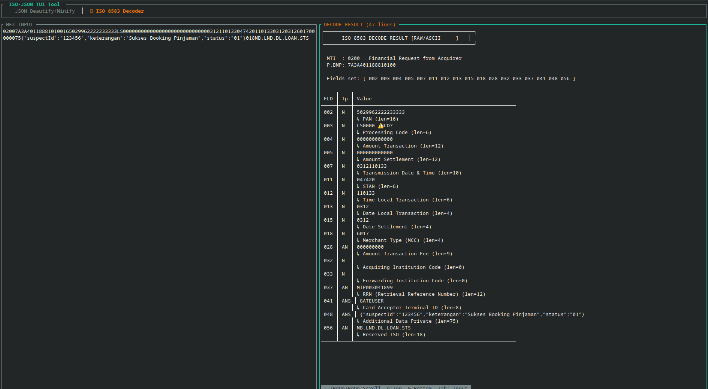
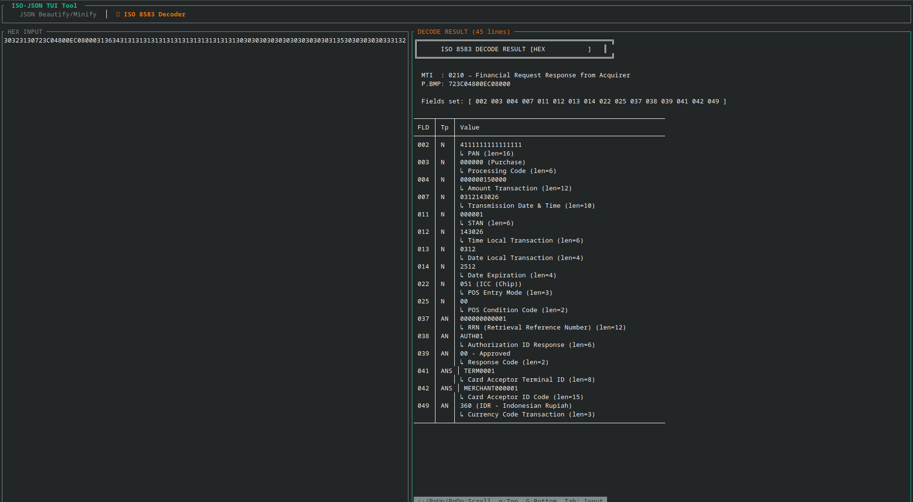
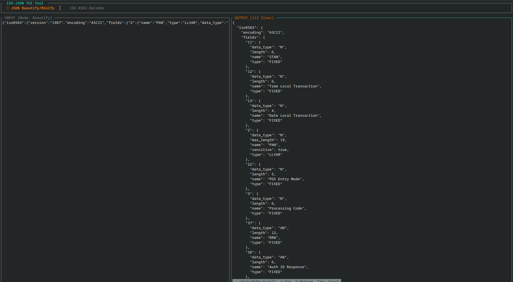
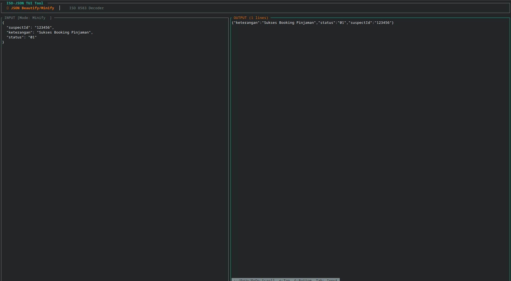

# IsJack Tool

A Rust terminal UI app with two tools:
1. **JSON Beautify/Minify** — paste JSON to format/compress it
2. **ISO 8583 Decoder** — paste a hex-encoded ISO 8583 message to decode all fields

## Build & Run

```bash
# Extract source
tar -xzf isjack_tool_src.tar.gz
cd isjack_tool

# Build (requires Rust 1.74+)
cargo build --release

# Run
./target/release/isjack_tool
```

## Key Bindings

| Key | Action |
|-----|--------|
| `F1` | Switch to JSON Beautify/Minify tab |
| `F2` | Switch to ISO 8583 Decoder tab |
| `F5` | Process / Decode the input |
| `F6` | Toggle JSON mode (Beautify <-> Minify) or Toggle ISO 8583 (Hex/ASCII <-> ISO8583)| 
| `Tab` | Switch focus between Input and Output panes |
| `Ctrl+L` | Clear input |
| `Ctrl+Q` | Quit |
| `↑↓` / `PgUp/PgDn` | Scroll (in output pane: `g` = top, `G` = bottom) |

## ISO 8583 Input Format

Paste the hex-encoded binary message (ASCII encoding assumed):
- MTI: 4 bytes (8 hex chars), e.g. `30323030` = "0200"
- Primary Bitmap: 8 bytes (16 hex chars)
- Secondary Bitmap (if bit 1 set): 8 bytes (16 hex chars)  
- Data fields follow in bitmap order

## Dependency Note

ratatui 0.30.0 requires Rust 1.85+ (edition2024). The Cargo.toml uses `0.29.0` 
which is API-identical and supports Rust 1.74+. Simply change to `"0.30.0"` 
when building with Rust 1.85+.


##support formater
- JSON: Paste JSON to beautify or minify
- ISO 8583: Paste hex-encoded ISO 8583 message to decode fields

## image result
ISO ASCI-ISO8583



ISO HEX-ISO8583


JSON Beautify


JSON Minify

